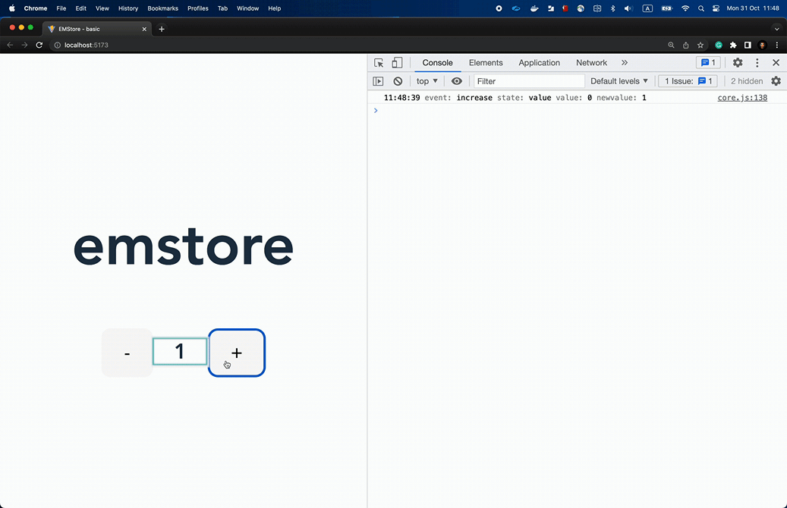
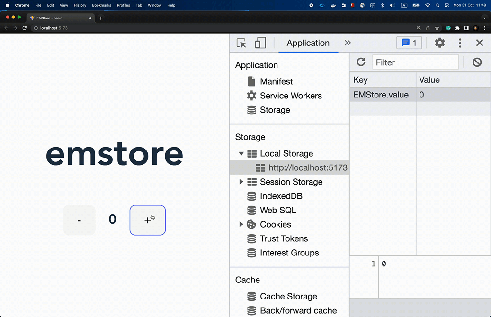

### Basic demo with event logs and persistence

In this demo, you can increase and decrease value and on every action, it logs the event into the console, and when you refresh a page app will load the state from local storage.



You can check the console and you'll see that emstore is saving every state change in local storage.



#### Install

Install dependencies.

```
npm install --legacy-peer-deps
```

#### Run

Run in development mode.

```
npm run dev
```