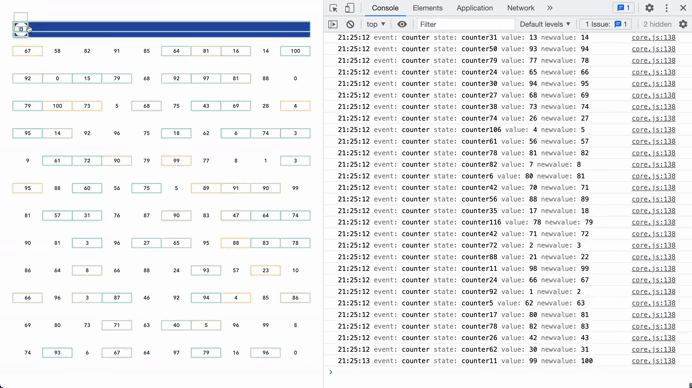
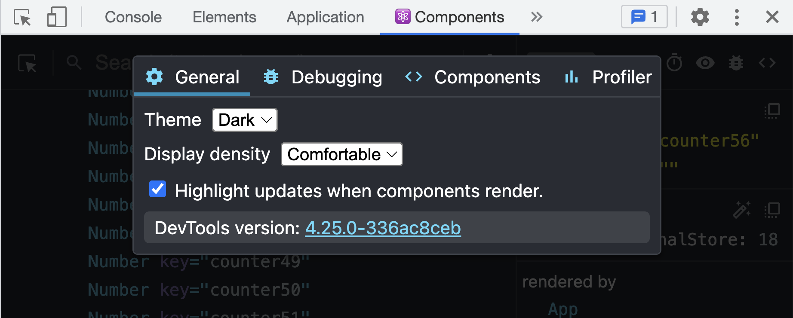

### Numbers demo with event logs

#### Description

In this demo, you are able to see only components that are changing are updated. On the top slider is the interval timeout time, lower the value updates will be faster. On the right in the console log, you can see which state is changed with event details.

#### Install React Developer Tools

For this demo, you will need `React Developer Tools` to see components updates: https://chrome.google.com/webstore/detail/react-developer-tools/fmkadmapgofadopljbjfkapdkoienihi?hl=en

#### Turn on component updates

Turn on `Highlight updates when components render`.

